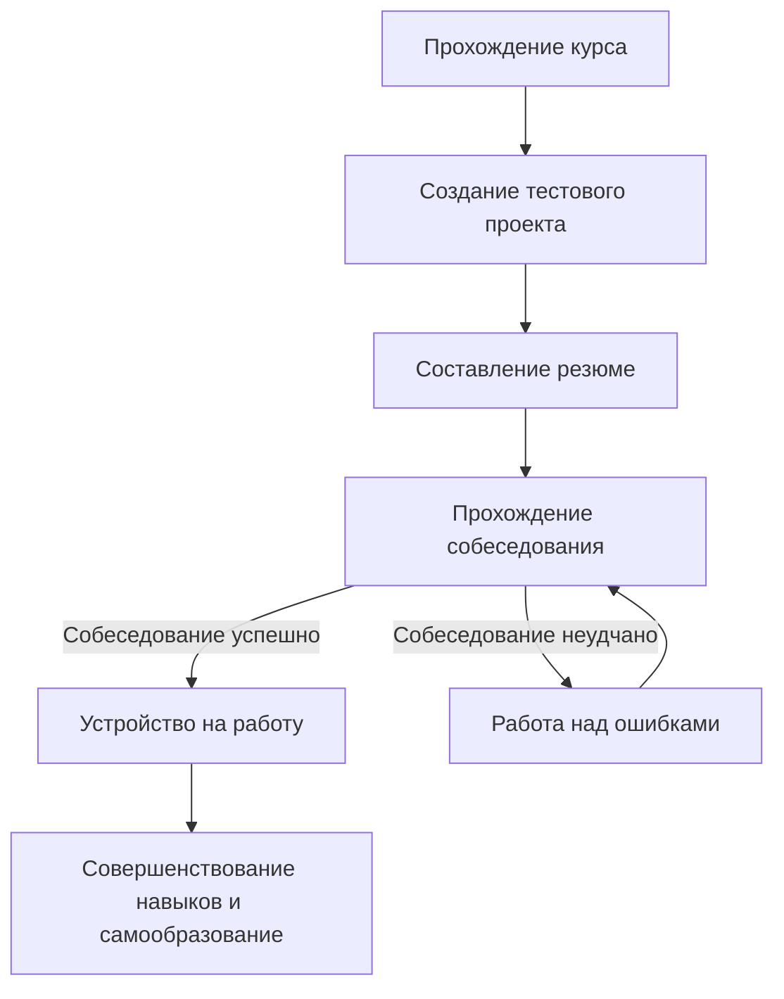

# Дорога к освоению профессии DataEngineer 💯
Чеклист для получения первых навыков и знаний. Необходимо определить с чем нужно научиться работать и что потребуется изучать отдельно от курса.

## Основной стек технологий

✅ - преподается на курсе
❌ - необходимо изучать отдельно

**Языки программирования:**

- ✅  **Python:** является стандартом индустрии для дата-инженеров благодаря своей гибкости и множеству библиотек.

**Базы данных:**

-  ✅ **SQL:** необходим для работы с реляционными СУБД (например, PostgreSQL).
-  ✅ **NoSQL:** понимание различных типов хранилищ, таких как MongoDB или Redis.
-  ✅**Колоночные БД:** знание систем, оптимизированных для аналитики, например, ClickHouse.

**Big Data технологии:**

-  ✅ **Spark** и ✅**Hadoop** для обработки больших объемов данных, которые не умещаются на одном сервере.
-  ✅**Kafka** для обработки потоковых данных.

**Оркестровка и автоматизация:**

-  ✅ **Apache Airflow** для автоматизации и планирования рабочих процессов обработки данных.
-  ❌ **dbt:** для трансформации данных в хранилище.

**Другие важные навыки:**

-   **Облачные технологии:** понимание принципов работы облачных платформ (например, Snowflake, Amazon Redshift, Google BigQuery).
-  ✅ **Linux и Git:** базовые знания для работы с операционными системами и системой контроля версий.
-  ✅ **ETL/ELT:** принципы извлечения, преобразования и загрузки данных.
-  ✅  **Docker:** для понимания принципов контейнеризации и разворачивания полноценных рабочих инстансов.

Некоторые технологии необходимо дополнительно изучать параллельно основному курсу для лучшего понимания вариантов использования.

## Будущее после прохождения курса

Предполагаемое будущее после окончания курса:

